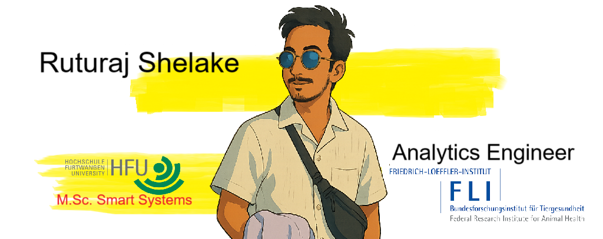
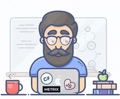

<!-- Main Banner Image -->

  

<!-- Visitor Counter (Optional: Use shields.io or similar services) -->

  
  &nbsp;
  

<!-- Skills / Specializations -->

<h1 align="center">Data Analysis | AI | Data Pipelines</h1>

---

## 💫 About Me
<table width="100%">
  <tr>
    <td style="text-align: justify;">

I'm a passionate **Data Engineer** and **Analyst** with over 3 years of experience, dedicated to transforming raw data into actionable intelligence and scalable solutions 📊. My journey lies at the intersection of engineering, data science, and real-time analytics, with a strong focus on optimizing manufacturing processes and embracing Industry 4.0 principles.

I have completed my **M.Sc. in Smart Systems from Hochschule Furtwangen University**. Currently, I am working at the **Friedrich Loeffler Institute (FLI)** as an **IT Mitarbeiter** for the HaDEA project with **EFSA (European Food Safety Authority)**, where I develop pipelines for automated data mapping and ensure the smooth functionality of data flow into the Data Warehouse.

Driven by a curiosity for uncovering hidden patterns and a commitment to data-driven decision-making, I leverage technologies like **Python, SQL, Apache Kafka, Airflow, and Power BI** to build robust data pipelines, enhance BI reporting, and solve complex challenges.

🌱 I'm continuously learning and improving, currently enhancing my German language skills (B1 level) to better collaborate within the German work environment.

 
    </td>
  </tr>
</table>

---

## 🛠️ Tech Stack & Skills

**Programming & Databases:**

**Data Engineering & Big Data:**

**BI & Visualization:**

**Libraries & Tools:**

**Other Skills:** Data Cleaning & Validation, KPI Development, Statistical Analysis, Machine Learning (Basics), Process Optimization.

---

## 📫 Get In Touch

I'm always open to discussing data engineering, analytics, potential collaborations, or just connecting with fellow tech enthusiasts!

<!-- Social Media Buttons -->

  
  &nbsp;
  

Thanks for visiting my profile!
